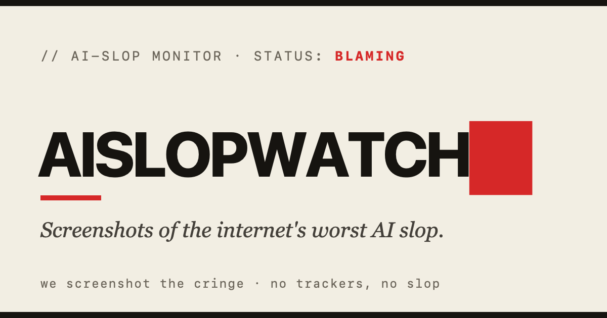

Every watchdog needs a first bark. Here's ours.

The internet has quietly filled up with stuff no human wrote, drew, coded, or stands behind. Text, images, apps, whole products, all extruded by a machine and shipped before anyone looked. Somebody should probably keep an eye on that. So we are.

AISlopWatch files two species of cringe. **Slop**: machine-made filler produced at the speed of light because nobody had to think. The listicle that's three sentences in a trench coat. The five-star treadmill review written by something with no knees. The app that's just a login screen wrapped around someone else's API. And **hype**: the very-much-awake human announcing, with emojis, that AI just became sentient, fell in love with him *personally*, and is about to make him $40,000 before lunch. The slop didn't read itself. The hype guy read it twice and called it a revelation.

That's the desk. The presses work, the lights are on, and somewhere out there an "SEO-optimized" article is being born with seventeen H2 headings and not a single fact.

Spotted some in the wild? Bring the receipts. Welcome to the AI Slop watch.

---

*Suggested by [@aislopwatcher](https://github.com/aislopwatcher) · approved by the editor.*
